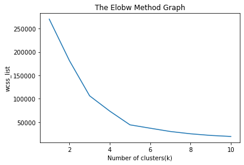
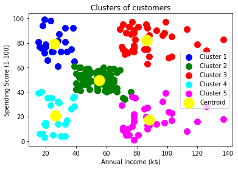
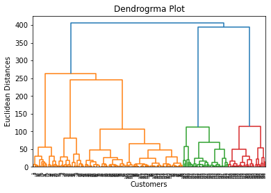
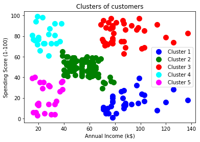

# K-mean Clustering

Unsupervise ML model which created 5 clusters and predicted or categorized the customer
based on Annual Income and money spend in the mall.

Data consist of the customers Annual Income, Gender, Money spend in the mall who visited the mall.
We find the optimized value of k by using 'Elbow methond' then we predict and made clusters.

  
  

